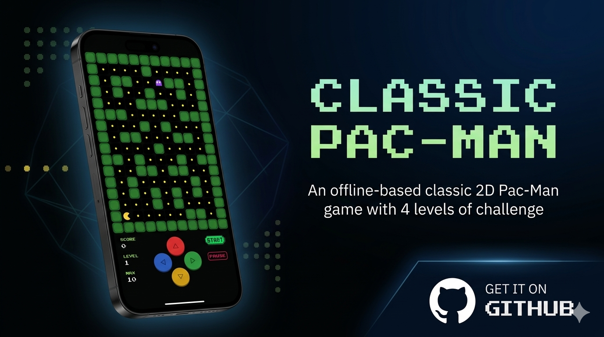

  

---

## 🎮 How to Play

- Eat all the **yellow dots** to level up.
- Avoid the **ghosts** or it's game over!
- Every new level adds a new ghost and gets faster.

---

## 🕹️ Controls

| Input | Action |
| :--- | :--- |
| ⬆️ ⬇️ ⬅️ ➡️ **D-Pad** | Move Pac-Man |
| 👆 **Swipe** | Move Pac-Man |
| ⏸️ **PAUSE** | Pause the game |
| ▶️ **START** | Reset / Start the game |

---

## 📥 Install

1. Go to the [Releases](https://github.com/Aluchashi/Pac-Man/releases/tag/v1.0.0) page.
2. Download the latest `android.apk`.
3. Open the APK on your Android phone.
4. Done — enjoy the game! 🎮

> 💡 **Note:** Allow *"Install from unknown sources"* if prompted by your device.

---

  Made with ❤️ using <strong>Flutter</strong>

